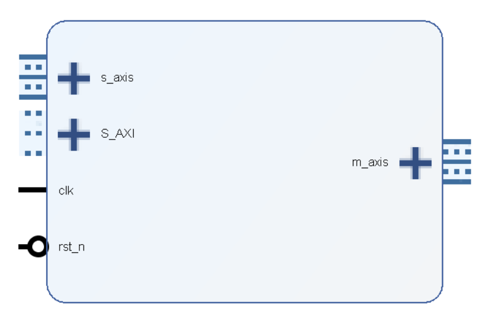
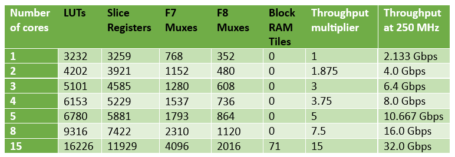

# AES-256 CTR Hardware Design  

**Description:**

VHDL hardware design of AES-256 CTR-mode encryption for ASIC or FPGA implementation with SystemVerilog testbench.

The design features a complete CTR encryption/decryption design with AXI-4 Stream interfaces for the plaintext and ciphertext, and an AXI Lite interface for dynamically reconfiguring the key and IV, as well as exposing a control register and status register. The design is highly customizable, allowing for an adjustable tradeoff between throughput and resource usage. At the highest level, one 128-bit block is encrypted each clock cycle. The width of the CTR Counter is customizale, and the design supports an optional keystream buffer for precomputing keystream blocks to be ready when plaintext data arrives. The AES-256 keygen is also included in the design.

A complete documentation is available as a [PDF](documentation/AES_256_CTR.pdf).

**Implementation overview**

The `aes256_CTR_mode_top.vhd` file is the top level for the design, and consists of `axi_regs.vhd` and `aes256_CTR_mode_main.vhd`. `axi_regs.vhd` implements the AXI Lite interface, while `aes256_CTR_mode_main.vhd` contains the CTR logic and keystream buffer. The AES cipher is implemented in `aes256_engine.vhd`, as a two-part design - *key expansion* (`key_expansion_top.vhd`) and *encryption* (one or more instance of `aes_core.vhd`). For the purpose of this implementation, AES-256 encryption is divided into 15 rounds (1 initial + 13 normal + 1 final). When only a single AES Core is used, a single instance of (`aes_core.vhd`) is instantiated, which handles all 15 rounds. When several AES Cores are used, each core handles only a subset of the rounds, e.g. 5 rounds per core with 3 cores in series. Inside `aes_core.vhd`, each round is divided into four stages, and four AES blocks can be pipelined through the core at once.

## Top level illustration of I/O

## Utilization and Performance Overview
The design features several generics, where the most important one is the number of AES Cores to use. More cores increase resource usage and throughput. Synthesis results from a zynq7000 device are as shown:

## Test bench and verification

Testbench is implemented in a SystemVerilog file `aes256_loading_tb.sv`, with subdesigns `data_producer.sv` and `data_consumer.sv`. The python script `generate_test_data.py` is used to generate reference input (key, IV and plaintext) and output (ciphertext) vectors. Input vectors are then used by the testbench to drive the DUT, while output vectors are used in the checker. Usually, more than one key/IV pair is generated by `generate_test_data.py`, in which case the tests alternate between inserting random delays on the AXI4-Stream producer and/or consumer, or no delays at all. This ensures that a wide range of timings are tested, increasing the robustness of the test. Since the design is highly customizable, with several generics to tweak, the `simulate_all.py` script can be used to schedule a sequence of several simulations with different values for the generics.

**Status**  
Basic functional verification is done with with 100 different key/IV pairs, and each pair is tested with 1000 different plaintext/ciphertext blocks. This is repated with values {0, 3, 10} for the keystream buffer size, values {32, 64} for the IV Counter width and values {1, 2, 3, 4, 5, 8, 15} for the number of AES Core, for a total of 100 * 1000 * 3 * 2 * 7 = 4 200 000 blocks encrypted.

## Acknowledgements

The AES-256 encryption part of the design is based on the [design by Aleksandar Lilic](https://github.com/AleksandarLilic/AES-256_hardware_design).